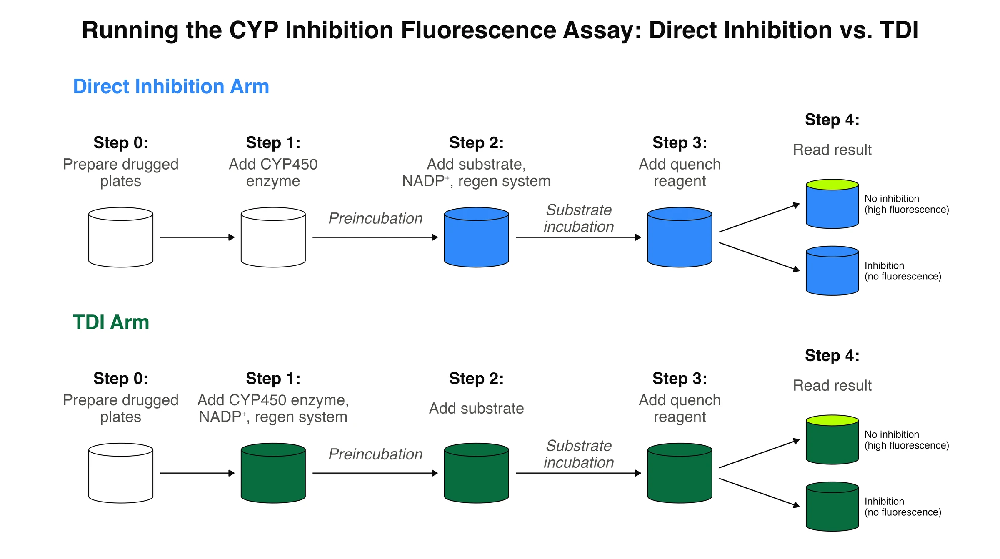
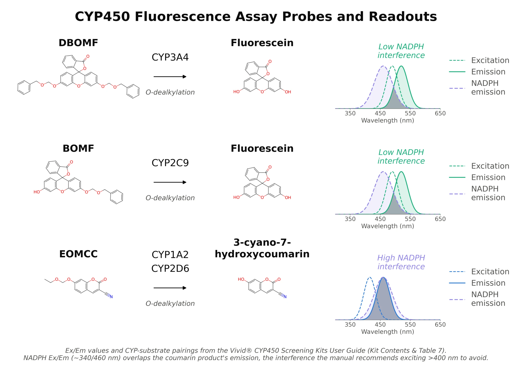
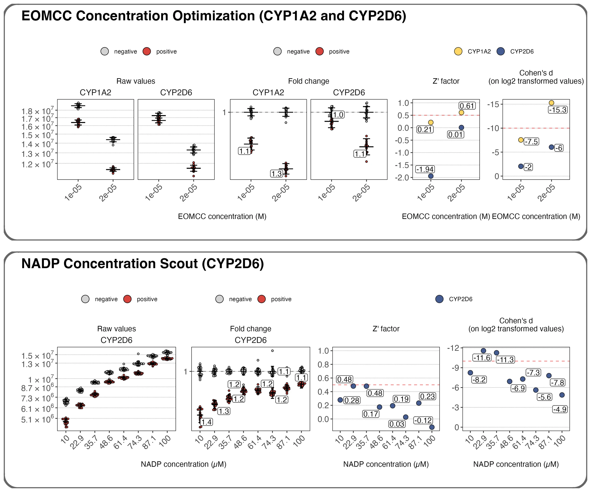
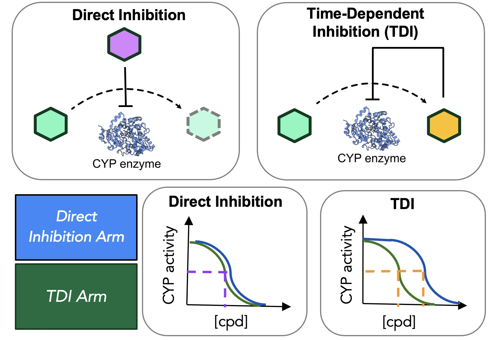
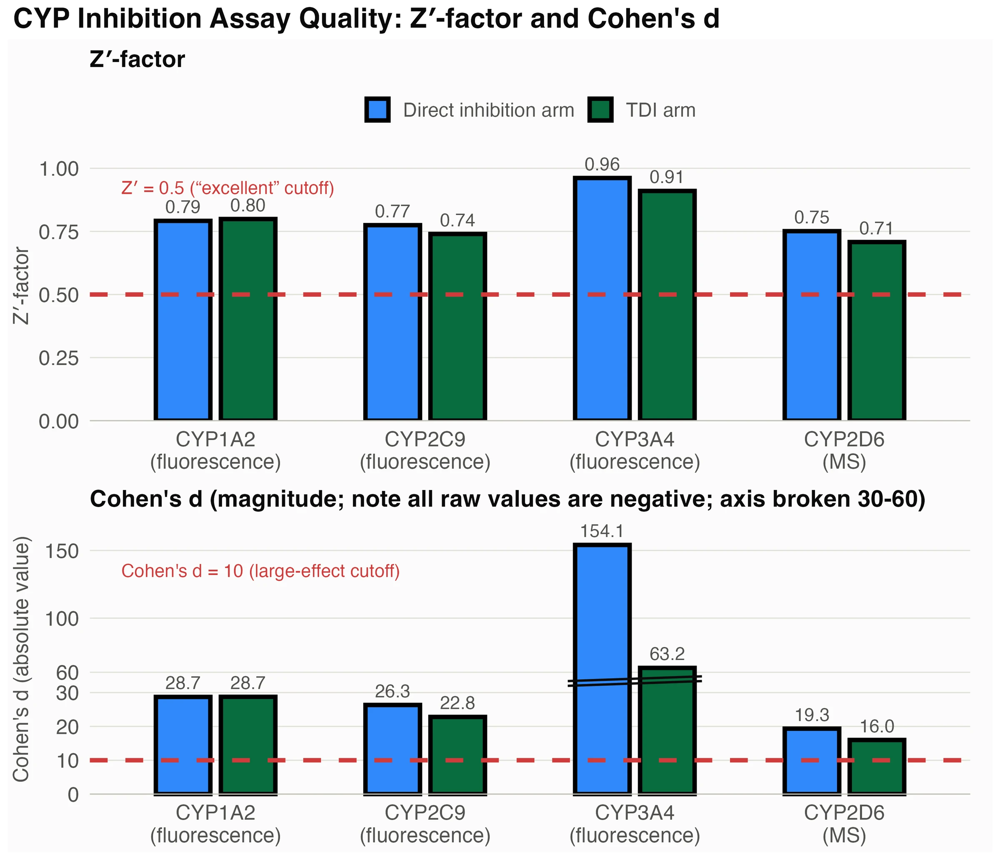
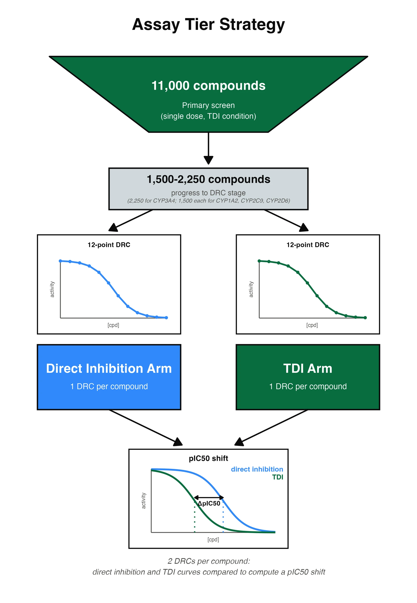

:::{.doc-authors}
Lauren Orr [](https://orcid.org/0009-0003-4326-5789),
Scott Simpkins [](https://orcid.org/0000-0002-5997-2838),
Hugo MacDermott-Opeskin [](https://orcid.org/0000-0002-7393-7457)
:::

## Introduction

“We don't need better rules of thumb. We need more datasets like this one, and the models we can build on top of them” is how Pat Walters closes the most recent OpenADMET blog post<a href="#ref-1" class="cite-tip" data-tooltip="Walters, P. (2026). Do Our CYP Structural Alerts Actually Work? OpenADMET.">1</a>. At Octant, we have spent the last year building robust, reproducible, and scalable CYP inhibition assays in order to generate datasets of the size needed to fuel machine learning models. In optimizing for these qualities in the assays, we also had to make some tradeoffs such as the level of physiological relevance, compound tiering, and others. However, we believe these tradeoffs were strategic to achieve our goals of delivering a large, high-quality bolus of data. In this post, we hope to show readers, particularly those building machine learning models, the care we took to build high-confidence assays and how we meticulously QC our data and analysis methods for mapping CYP inhibition across chemical space.

## Background

CYP450s are a family of heme-containing liver enzymes that act as the primary drivers of Phase I xenobiotic metabolism. Most oral drugs are optimized for moderate hydrophobicity to improve their ability to cross cell membranes. CYP450s carry out reactions like hydroxylation, N/O-dealkylation, and epoxidation to transform these somewhat greasy xenobiotics into more polar metabolites. These can then be directly filtered by the kidneys or functionalized with a polar group during Phase II metabolism by enzymes such as UGTs, SULTs and GSTs<a href="#ref-2" class="cite-tip" data-tooltip="Zhao, M.; Ma, J.; Li, M. et al. (2021). Cytochrome P450 Enzymes and Drug Metabolism in Humans. International Journal of Molecular Sciences.">2</a>. As CYPs evolved to metabolize a diverse range of substrates and protect the body from as many foreign substances as possible, many have large, plastic active sites that can accommodate an extraordinarily diverse range of substrates. Unfortunately, this flexibility makes their selectivity behavior challenging to predict.

Alongside CYPs’ ability to bind many substrates is their susceptibility to inhibition by many drugs. When a candidate inhibits a CYP isoform, it slows clearance of any co-administered drug that depends on that enzyme, raising levels of the “victim” drug. This is called a drug-drug interaction, or **DDI**, the most common and clinically significant CYP-mediated liability. DDIs are especially dangerous for **narrow-therapeutic-index drugs**, where only a small gap separates the exposure needed for efficacy (e.g., plasma levels maintaining coverage above the EC50) from the exposure that triggers toxicity. The anticoagulant warfarin is one such case, where even modest inhibition of CYP2C9, the CYP that clears warfarin, raises bleeding risk.

Even further, a special case of CYP inhibition can occur when a CYP substrate is transformed into a more potent reversible inhibitor or a reactive intermediate that covalently disables the enzyme via the protein or heme cofactor. This phenomenon is called **Time-Dependent Inhibition (TDI)**, since these drugs show increased inhibition potency when incubated with the CYP isoform over time, as more inhibitory metabolite can build up, while non-TDI inhibitors show a stable IC50 across time points. The drug troleandomycin, for example, is transformed into a nitrosamine by CYP3A4, trapping the enzyme’s active-site heme and causing patients who also take terfenadine to build up toxic doses of the latter and develop arrhythmias (via off-target hERG inhibition).

The dataset we built covers the four CYP isoforms that drive ~72% of small-molecule drug metabolism: CYP3A4, CYP2D6, CYP2C9, and CYP1A2<a href="#ref-3" class="cite-tip" data-tooltip="Zanger, U. M.; Schwab, M. (2013). Cytochrome P450 enzymes in drug metabolism: regulation of gene expression, enzyme activities, and impact of genetic variation. Pharmacology &amp; Therapeutics.">3</a>. Reversible-inhibition data are unevenly distributed across these four in the public domain; consistently generated, cross-isoform data are rare, and very little TDI data exist, particularly for enzymes outside CYP3A4. Below, we will explain how we built and scaled robust assays from commercially available reagents to collect data on these four isoforms, including our tiering strategy to estimate IC50 values and to characterize inhibitors as direct inhibitors or TDIs.

## Assay Design

To screen tens of thousands of compounds, we optimized for scalability, speed, low cost, and robustness, which informed our choices for assay reagents, timing, readout, and screening strategy. First, we chose to assay each CYP isoform individually with recombinant enzyme rather than pooled human liver microsomes (HLMs). HLMs, which can be purchased as pooled from human donors, are more physiological since they contain all the native CYPs and associated proteins required for their function. However, because they contain every hepatic CYP, deconvoluting which isoform is responsible for an observed signal is challenging, since several CYPs and substrates can interfere with each other. For example, molecule X may be partially inhibitory to CYP2D6 and CYP3A4, so an IC50 for each may be inaccurately measured; or, a reference substrate used for detecting inhibition may partially interact with other CYPs, so inhibition of other CYPs by other molecules may confound the inhibition measurement. Single-CYP assays, on the other hand, trade some physiological relevance for a simpler and more cleanly isoform-attributable readout, since we can be certain that each inhibition data point we gather is on target with the CYP it is being screened against. For our assays, we use Discovery Life Science’s Supersomes, a proprietary line of vesicle-like isolates called microsomes harvested from insect cells expressing a single human CYP isoform along with the associated biological machinery. Supersomes are not cells, so our assays are considered *in vitro*, but they contain accessory proteins and ER membrane. The CYP complexes are membrane-bound, as they would be in human liver cells, providing more biological relevance than soluble recombinant protein. CYPs are monoxygenases that require an electron donor to drive their catalytic cycle, so we supplement the Supersomes with NADP+ (the oxidized form of the cofactor), and include an NADPH regeneration system (glucose-6-phosphate degradation and glucose-6-phosphate) to generate reduced cofactor. This keeps NADPH in excess and roughly stable, driving the reaction at a constant rate, since substrate is also supplied in excess.

We adapted the commercially available Vivid CYP fluorescence kits (ThermoFisher) to 4 uL endpoint assays at 1536-well scale, enabling the exceptionally low material costs (<$1/well) needed to scale our number of data points. The assay detects CYP activity via the use of masked fluorophores, where CYP-mediated removal of the protecting group releases a quantifiable fluorescent product. We identified high-quality probes for three of the four target CYPs: DBOMF for CYP3A4, BOMF for CYP2C9, and EOMCC for CYP1A2. The assay is carried out in only three dispense steps, which are easily automatable: a CYP master mix is added to drugged plates, then a substrate mix, then the assay is quenched with Tris base and read out on a plate reader (**Figure 1**).

#### Figure 1: Assay workflow {.figure-toc}

{fig-alt="Three-step 1536-well plate workflow: CYP mix, then substrate, then quench and read, with cofactor timing splitting the two assay arms."}

:::{.figure-caption}
**Figure 1:** Workflow for running the CYP inhibition assay. The general procedure and reagents were adapted from the Thermo Vivid P450 Assay kit<a href="#ref-4" class="cite-tip" data-tooltip="Life Technologies (2012). Vivid CYP450 Screening Kits User Guide. Thermo Fisher Scientific.">4</a>, but we adapted it to 1536 well-scale and designed a two-armed approach to assess TDI. Assay arms will be discussed in more depth later in this post.
:::

We chose to develop fluorescence-based assays because of their low cost, robustness, and scalability, but fluorescence has drawbacks. Fluorogenic probes may not be the most physiologically relevant model for in vivo inhibition, since CYP binding pockets are massive and substrates can adopt various binding poses. For example, for CYP3A4, it’s common practice to test compounds for inhibition using 2-3 substrates by LC-MS in a detailed study. Fluorogenic probe substrates carry their own interference and quenching liabilities—a compound that happens to absorb or quench at the probe's emission wavelength can look like an inhibitor without being one, and some compounds tested as inhibitors may also show autofluorescence, interfering with the assay.

While the fluorescein-based probes for CYP3A4 and CYP2C9 performed very well with little optimization on our end, coumarin-based probes were challenging to use because NADPH fluoresces at a similar wavelength. Thus, we were limited to lower concentrations of NADP+ in the CYP1A2 and CYP2D6 fluorescence assays, which employ the coumarin-based probe EOMCC (**Figure 2**). By supplying the assay with a lower concentration of electron donor, the CYP reaction proceeds at a slower rate, leading to lower fold changes between the positive and negative controls. Fortunately, EOMCC is a high-quality enough substrate for CYP1A2 that we were able to achieve passable effect sizes by increasing the concentration of the substrate. However, this was not the case for CYP2D6, and we had to pivot to a mass spectrometry-based readout (**Figure 3**).

#### Figure 2: Fluorogenic probes and spectra {.figure-toc}

{fig-alt="Structures of the DBOMF, BOMF and EOMCC probes beside their products' excitation and emission spectra, the coumarin dye overlapping NADPH."}

:::{.figure-caption}
**Figure 2:** The three fluorogenic probes employed in this study and the excitation/emission spectra of their products. All probes undergo O-dealkylation by the four CYP isoforms we are studying to produce either fluorescein or a coumarin dye (3-cyano-7-hydroxycoumarin). The coumarin dye’s spectra overlaps significantly with NADPH’s, leading to significant interference in the assay, especially for CYP2D6, which showed lower fold change when using EOMCC as a substrate.
:::

#### Figure 3: Coumarin probe optimization {.figure-toc}

{fig-alt="Control signals, fold changes and effect sizes plotted against a dashed quality threshold as EOMCC and NADP concentrations are varied."}

:::{.figure-caption}
**Figure 3:** Optimization of coumarin-based probe fluorescence assays; positive and negative control means and standard errors are plotted as raw values and fold changes, then are used to calculate effect sizes. The red dashed lines indicate our assay quality threshold. Top: Using higher concentrations of EOMCC gave only marginally better fold change, but variance decreased enough that the CYP1A2 assays achieved acceptable effect sizes. Bottom: Since variance and fold change were still poor in the CYP2D6 assay, we tried scouting for a different NADP concentration, but we were unable to optimize the assay further because CYP2D6 does not metabolize EOMCC well enough to counteract the assay interference from using higher NADP.
:::

Developing an MS assay is much lower throughput in terms of acquisition time of plates and data analysis speed, but the trade-off was worthwhile because it expanded the range of potential probe substrates to any molecule with a catalysis-induced mass shift and acceptable ESI+ ionization in the assay matrix. We tested dextromethorphan and bufuralol, both FDA-validated CYP2D6 DDI probe substrates. Bufuralol was less stable in our experiments than dextromethorphan, so we produced more repeatable results using the latter. Dextromethorphan undergoes O-demethylation to produce the lower-molecular-weight metabolite dextrorphan. Using a SCIEX Echo-MS+ system with a 7600 QTOF mass spectrometer, both the substrate and product ions showed linear quantification. For the inhibition assay, we can use substrate depletion or product formation to measure activity, but we chose product formation because the data was marginally less sensitive to substrate dispense-volume errors from our bulk liquid dispensers. This is because the bulk dispensers sometimes vary slightly in volume during the dispense cycle, causing “striping” patterns to form on the plate following the path of the dispense heads. In terms of raw MS peak area signal, the substrate was much higher than the metabolite, and metabolite formation was less affected by plate striping compared to substrate. Also, measuring product formation is identical to how our fluorescence assay is performed, so doing so in the MS assay simplified the analysis and allowed us to be more consistent between datasets, despite the different quantification methods.

The Echo-MS+ system allows us to deliver 10 nL diluted assay droplets directly into the mass spectrometer using acoustic ejection, without a chromatography or cleanup step, enabling unprecedented MS data acquisition speed (1536 samples in ~1 hour). Because evaporation from the plate during acquisition necessitated a smaller volume, we scaled the assay down further to 2 uL and diluted with DMSO, further lowering cost per data point. The rest of the assay is performed identically to the fluorescence assay.

To test for time-dependent inhibition, the assay must be performed as dose-response curves under two different conditions per compound (**Figure 4**). In the **direct inhibition condition**, which identifies inhibitors that do not require bioactivation via the CYP, compounds are incubated for 30 minutes with CYP but without NADP(H); NADP(H) is added when the substrate is dispensed. **In the TDI condition**, compounds are incubated with CYP and NADP(H), allowing enzyme catalysis and thus bioactivation of potential TDI compounds. Both assay arms are performed simultaneously and for the same amount of time; only the cofactor is added in different liquid dispenses (**Figure 1**). Compounds which display TDI will appear more potent after incubation with active CYP, whereas compounds which do not show time-dependence should have the same IC50. Therefore, our readout for TDI is the difference between the two IC50s, called the IC50 shift. While 1.5x shifts are often considered the threshold for TDI<a href="#ref-5" class="cite-tip" data-tooltip="Berry, L. M.; Zhao, Z. (2008). An examination of IC50 and IC50-shift experiments in assessing time-dependent inhibition of CYP3A4, CYP2D6 and CYP2C9 in human liver microsomes. Drug Metabolism Letters.">5</a>, we chose to use the more conservative estimate of 2x (or pIC50 difference of > 0.31), which aids in reducing the possibility of false positives due to assay error. This is especially necessary since we are not performing further follow-up kinetic studies, such as may be done in the context of a real drug discovery program.

#### Figure 4: Direct vs. time-dependent inhibition {.figure-toc}

{fig-alt="Schematic of direct versus bioactivation-dependent inhibition, above paired dose-response curves that shift left only for a TDI."}

:::{.figure-caption}
**Figure 4:** Top: Compounds can either inhibit CYPs directly, or they may require bioactivation before exhibiting inhibition (TDI). Bottom: Dose-response curve behavior in both arms of the CYP inhibition assay in the case of either inhibition type. Direct inhibitors will show the same pIC50 in both assay arms, while TDIs will exhibit a left shift for the TDI arm.
:::

Compound potencies span several orders of magnitude in range, but the threshold for associated pIC50 shifts is typically quite small. During assay development, we found that pIC50s could vary slightly from day to day because of slight changes in assay timing and exact makeup of the assay matrix. While these changes are inconsequential for pIC50 estimates, they could significantly affect whether we called a TDI hit. To minimize this variability, we must treat each well in the two assay arms as identically as possible. Different plates run in the same batch can vary because plates inevitably receive reagents at slightly different times due to the nature of our automation systems, so we designed plate maps so both assay arms for each compound are performed on the same plate. Using this design, wells for each assay arm occur simultaneously. We tested the improved plate design using a small pilot screen and found the shift data to show significantly less variability, so we carried this design forward to the actual DRC screening.

There are a few other tradeoffs to our assay design approach. Namely, our preincubation design uses only a 30-minute preincubation, which may under-detect slow inactivators whose inactivation kinetics only become apparent over longer exposure. The IC50-shift approach is a screening proxy, not a full mechanistic characterization of kinetic parameters, and cannot distinguish reversible from covalent inactivation or identify which metabolite is responsible. However, these limitations are offset by the dataset's sheer size. Understanding the mechanistic interactions between CYPs and diverse chemotypes inherently requires large amounts of data.

## Discussion

### Assay Effect Sizes

The strong effect size of our assays allows us to detect subtle pIC50 variations between compounds, enabling high-resolution CYP inhibition SAR analysis. Effect size is a statistical measure we use to assess assay quality by measuring differences between positive and negative control groups. Below we report Cohen’s d (the difference between the positive and negative control means divided by the pooled standard deviation), and the Z’ (another measure calculated from the two control means and their associated standard deviations, commonly reported for high-throughput screens). A Cohen’s d of greater than 10 (sign inverted for inhibition assays, so less than -10) or Z’ of greater than 0.5 is considered an excellent assay. While the assays’ effect sizes vary due to enzyme activity, probe performance, and readout, all four assays exceeded the high bars we set for effect size.

The primary screen was performed on Enamine's DDS10 diversity set, which contains ~10,000 compounds selected for scaffold and property coverage across drug-like space, plus a deck of ~1,000 FDA-approved drugs that anchors the library in chemistry with known clinical CYP behavior.

#### Figure 5: Assay effect sizes {.figure-toc}

{fig-alt="Two stacked bar panels, Z'-factor above absolute Cohen's d; blue direct and green TDI bars per isoform all tower over a low red dashed cutoff."}

:::{.figure-caption}
**Figure 5:** Effect sizes measured using Z’-factor and Cohen’s d for each assay arm, which all exceed the threshold for high-quality HTS assays. These values are from development experiments, but the effect sizes stayed consistent throughout our screening runs.
:::

### Tiering strategy

We performed single-concentration primary screens across the full library for each of the four CYP isoforms (**Figure 6**). We chose to screen at 50 uM, and while this high dose risks identifying too many hits, it is justified for our purposes because we aim to identify compounds with a range of weak and strong activity. Because DRCs are needed to estimate IC50s, it is unnecessary to perform the primary screen using both assay conditions. Instead, only the TDI condition is performed during the primary screen because, in most cases, inhibition levels are the same in both conditions; however, for TDI compounds, bioactivation may be required before observable inhibition occurs. This maximizes the number of actives promoted to DRCs across both conditions.

Hits were then run as 12-point DRCs in both assay arms and fit with the same Bayesian curve-fitting approach used for the PXR challenge, targeting ~1,500 compounds for CYPs 1A2, 2C9 and 2D6, and ~2250 for 3A4. The enzyme with the highest hit rate in primary screening was CYP3A4, which makes sense as it is known to be the most promiscuous and therefore clinically relevant. TDI was assessed for all 4 isoforms, but we chose to only evaluate challenge participants on 3A4 and 2D6 because 1A2 and 2C9 had insufficient TDI hit rates to adequately train models; this observation reflects the expected rate of TDI, which should correlate with each CYP isoform’s relative promiscuity.

To construct the test set for the blind challenge, we identified the top 25 unique hit compounds showing the highest level of inhibition for CYP3A4, CYP1A2, and CYP2C9, and ordered 10 chemisimilars from Enamine’s catalog per hit with the exception of CYP2D6 which used the same test set as the other three CYPs.

#### Figure 6: Tiering strategy {.figure-toc}

{fig-alt="Funnel from a single-dose 50 uM primary screen down to ~1,500-2,250 compounds run as dose-responses in both assay arms."}

:::{.figure-caption}
**Figure 6:** Assay tier strategy for gathering pIC50s for the four CYP isoforms. We start with a single dose-point (50 uM) screen on all compounds using only the TDI arm. We selected the top ~1500-2250 compounds which demonstrated the highest level of inhibition, and progressed them to two dose responses, one in each assay arm, to collect two pIC50s, from which a pIC50 shift can be computed.
:::

### Calling TDI

Our Bayesian DRC-fitting procedure enabled us to explore multiple methods, of varying sophistication, for labeling each molecule as a time-dependent inhibitor or not. All methods enforced that the IC50 decreased by 2-fold in the TDI vs. direct inhibition conditions (ΔpIC50 > log10(2) ≈ 0.3). The three methods are described below and demonstrated in the interactive visualization at the end of this section.

::: {.method-list}
1. The simplest method added a **threshold** of pIC50TDI condition > 4.3. In plain language, they say that the potency must increase in the time-dependent condition by 2-fold, unless the compound is a weak inhibitor, in which case we only care about its behavior in the time-dependent condition if it yields an IC50 < ~50 μM (which equals pIC50 > 4.3).
2. Statistically speaking, however, applying thresholds only on the pIC50 estimates is not particularly satisfying. Because we designed the DRC-fitting procedure so that compounds with borderline observable activity have increased uncertainty in their pIC50 estimates, instead of enforcing pIC50TDI condition > 4.3, we can enforce non-overlap between the credible intervals of the pIC50 estimates in the two conditions. So more specifically, we add the constraint of pIC50CI lower, TDI condition > pIC50CI upper, direct condition to enforce that the potency in the TDI condition was significantly greater than that in the direct inhibition condition.
3. Bayesian inference enables us to go one step further and combine inferred parameters into new quantities that we can perform statistical testing on. In general, the Bayesian sampling procedure we used for DRC-fitting yielded 4000 samples of each parameter, from which we computed its estimate (mean) and 95% credible interval (2.5 and 97.5 percentiles). However, instead of summarizing the parameters before comparisons, one can combine the individual samples across parameters to create a new parameter with its own distribution of samples. In this case, we computed 4000 new samples of the ΔpIC50 shift and summarized them to estimate the shift and its credible interval (mean and 2.5/97.5 percentiles, respectively). In addition to enforcing that the potency increased 2-fold (ΔpIC50 > log10(2)), statistical significance of the shift was confirmed by enforcing that the entire CI on the shift was above zero, or ΔpIC50CI lower > 0.
:::

**We chose the threshold method (Method 1) to label the training and test datasets for the competition**. These combined criteria are simple and very practical and, to us, seemed likely to resemble criteria that a drug discovery program would use to decide which compounds to investigate further for TDI liabilities. Additionally, methods 2 and 3 introduced a dilemma over how to label molecules that showed greater than a 2-fold shift in pIC50 but without statistical significance: are these compounds conclusively not TDIs, or should they not be labeled at all due to the ambiguity? Allowing unlabeled data into the test set gives participants opportunities to cleverly unmask some test-set molecules, so this also influenced our decision to choose method 1. Interestingly, for CYP3A4 and CYP2D6, we observed that each successive method had higher sensitivity to detect weak time-dependent inhibitors that originally showed no evidence of direct inhibition. In contrast, method 2 was much less likely to label lower-potency molecules as TDIs for CYP2C9 and CYP1A2, but method 3’s increased sensitivity recovered many of these labels.

#### Figure 7: TDI-shift explorer {.figure-toc}

::: {.figure-fullbleed}

<a href="figures/embed/index.html" target="_blank" rel="noopener">Open the explorer in a new tab &#8599;</a>

<iframe src="figures/embed/index.html" title="Interactive CYP TDI-shift explorer" loading="lazy"></iframe>
:::

:::{.figure-caption}
**Figure 7:** Interactive visualization of the dose-response curves in the training dataset. 6896 compounds were selected for dose-response follow-ups across one or multiple enzymes. In every plate, each enzyme was tested against one literature-annotated TDI control and one non-TDI control (labeled “control”), and, with the exception of CYP2C9, another literature-annotated compound (either TDI or non-TDI, labeled “literature”). The scatterplots compare the pIC50s measured in the time-dependent vs. direct inhibition conditions, with the distance above the y=x line being the observed pIC50 shift caused by time-dependent inhibition. A point is colored red if the chosen method calls that molecule as a time-dependent inhibitor, and gray if not. Mousing over a scatterplot point reveals (top to bottom) the molecule’s structure, information on how it was screened, an overlaid plot of the raw data and dose-response curve fits for the two conditions, exact pIC50 and shift values, and a detailed view of the posterior distribution of the two pIC50s (Methods 1 and 2) or the pIC50 shift (Method 3).
:::

## Conclusion

We developed high-throughput, robust, and cost-effective assays that showed very high effect sizes throughout the screening process, allowing us to collect high-quality data for the public domain. Although we made trade-offs in physiological relevance by using individual CYPs in vitro and fluorogenic probes in 3 of the assays, the data collected is clearly attributable to individual CYPs and shows expected hit rates consistent with reports in the literature.

In the recent OpenADMET PXR blind challenge, the margin between the top finishers was extremely close, indicating that model performance hinged more on data quality than model architecture and further highlighting the value of generating high-quality data. We look forward to evaluating the models built for the upcoming CYP inhibition blind challenge and welcome any further questions about our assay development or CYP inhibition assay design.

## References

:::{.reference-list}
<ol>
<li id="ref-1">Walters P. Do Our CYP Structural Alerts Actually Work? OpenADMET [blog]. August 11, 2026. <a href="https://openadmet.ghost.io/do-our-cyp-structural-alerts-actually-work/">openadmet.ghost.io</a></li>
<li id="ref-2">Zhao M, Ma J, Li M, Zhang Y, Jiang B, Zhao X, Huai C, Shen L, Zhang N, He L, Qin S. Cytochrome P450 Enzymes and Drug Metabolism in Humans. <em>Int J Mol Sci.</em> 2021;22(23):12808. PMID 34884615. <a href="https://pmc.ncbi.nlm.nih.gov/articles/PMC8657965/">PMC8657965</a></li>
<li id="ref-3">Zanger UM, Schwab M. Cytochrome P450 enzymes in drug metabolism: regulation of gene expression, enzyme activities, and impact of genetic variation. <em>Pharmacol Ther.</em> 2013;138(1):103-141. <a href="https://doi.org/10.1016/j.pharmthera.2012.12.007">doi:10.1016/j.pharmthera.2012.12.007</a></li>
<li id="ref-4">Life Technologies. Vivid CYP450 Screening Kits User Guide. Protocol part no. O-13873-r1 (MAN0003095). Rev. 24 April 2012. <a href="https://documents.thermofisher.com/TFS-Assets/LSG/brochures/VividScreeningKitManual24Apr20121.pdf">PDF</a></li>
<li id="ref-5">Berry LM, Zhao Z. An examination of IC50 and IC50-shift experiments in assessing time-dependent inhibition of CYP3A4, CYP2D6 and CYP2C9 in human liver microsomes. <em>Drug Metab Lett.</em> 2008;2(1):51-59. PMID 19356071. <a href="https://pubmed.ncbi.nlm.nih.gov/19356071/">PubMed</a></li>
</ol>
:::

## Acknowledgements

The authors would like to acknowledge experimental data, analysis and scientific input contributed by **Ayesha Ghazali, Ana Lindahl, Robert Warneford-Thompson, Sean Colby, Nathan Abell, Naomi Handly, and Pat Walters** for this blog post.

We would also like to acknowledge technical support for our CYP assay development from SCIEX and Discovery Life Sciences.

We would like to thank our funders for their support of OpenADMET, in particular ARPA-H, Radial (part of the [Astera Institute](https://ror.org/00ydx1s47)), Schrödinger Inc, and the Gates Foundation. We would also like to thank our partners Enamine, HuggingFace, OpenEye, CDD Vault, Discovery Life Sciences and the beamline staff at NSLS-II for their support.

This work is supported by the Advanced Research Projects Agency for Health (ARPA-H) under AVOID-OME, and Award Number 1AY1AX000035. The contents are those of the authors. They may not reflect the policies of the Department of Health and Human Services or the U.S. government. The content is solely the responsibility of the authors and does not necessarily represent the official views of the Advanced Research Projects Agency for Health.

## Code and Data Availability

Blog post source code, the interactive figure, and the methods behind it are on
**[GitHub](https://github.com/OpenADMET/octant-cyp-inhib-blog-post)**. Well-level assay signals, and the per-compound posterior samples of the inferred pIC50 and slope parameters that drive the interactive visualization, will be available on request following completion of the CYP inhibition challenge.

::::{.doc-version}
:::{.doc-version-left}
Last updated: August 24, 2026
:::
:::{.doc-version-right}
Built with ❤️ and [Quarto](https://quarto.org)
:::
::::

::::{.doc-version}
:::{.doc-version-left}
© 2026 OpenADMET
:::
:::{.doc-version-right}
Code licensed [Apache 2.0](https://github.com/OpenADMET/octant-cyp-inhib-blog-post/blob/main/LICENSE) · Data licensed [CC BY 4.0](https://creativecommons.org/licenses/by/4.0/)
:::
::::
